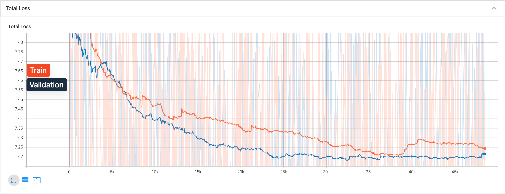
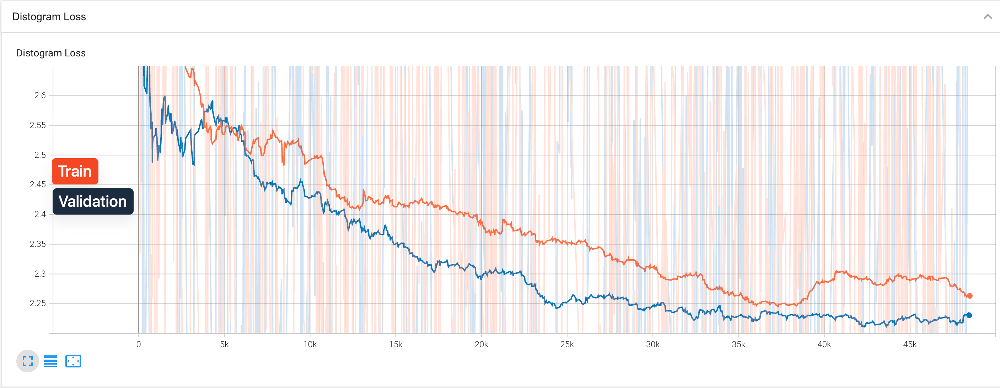
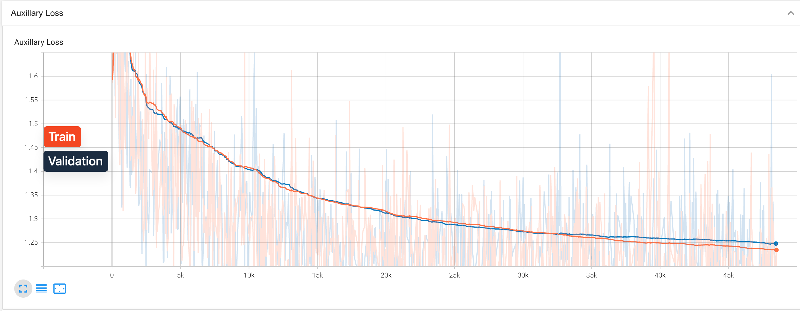
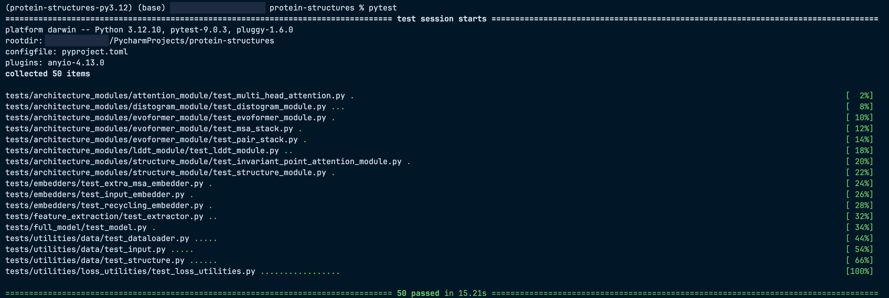
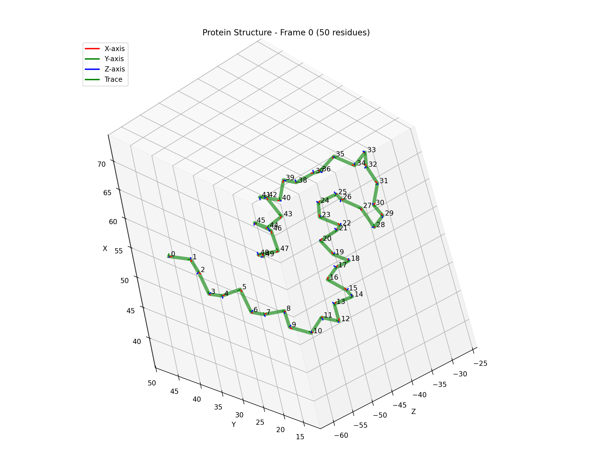

# Protein Structures

## Table of Contents
1. [Description of the Project](#description-of-the-project)
2. [Prerequisites](#prerequisites)
3. [Data](#data)
   - [Data Retrieval](#data-retrieval)
   - [Data Splitting](#data-splitting)
4. [Project Structure](#project-structure)
5. [Project Configurations](#project-configurations)
6. [Running First Training experiment](#running-first-training-experiment)
7. [Visualisation](#visualisation)
8. [Tests](#tests)
9. [Debugging](#debugging)
   - [Frame Debugging](#frame-debugging)
10. [Acknowledgments](#acknowledgments)

---

## Description of the Project
The primary goal of this project is to explore, implement, and train the AlphaFold II architecture utilizing an NVIDIA DGX Spark with 128GB of unified memory.

Given the massive scale and complexity of the original AlphaFold model, a core focus has been placed on maintaining rigorous test coverage across all individual modules.

This robust testing infrastructure provides the foundation needed to safely experiment with novel structural designs and alternative implementations in order to make the model fit into the device it is being trained on.

## Prerequisites

Before getting started, ensure you have the following tools installed on your system:

- **uv** [Package Management]:

We have transitioned to using `uv` as our package manager instead of `Poetry`. `uv` is written in Rust and provides phenomenally faster dependency resolution. **Crucially, `uv` acts as a full toolchain manager; you do not need to install Python manually.**

It will automatically fetch the required Python 3.12.10 version in the background.

- **MMseqs2** [Data Clustering]:

We use MMseqs2 to cluster our protein sequence data based on sequence identity. This clustering step is crucial before splitting our data into training, validation, and testing sets, as it prevents data leakage by ensuring closely related sequences are grouped together and not scattered across different splits.

### Setup Instructions

1. Clone the repository and navigate into it:
   ```bash
   git clone https://github.com/kelevra1993/protein-structures.git
   cd protein-structures
   ```

2. Create the virtual environment (`.venv`) and install all dependencies using `uv`:
   ```bash
   uv sync
   ```
   *(Note: Because of our `pyproject.toml` configuration, running `uv sync` will automatically download Python 3.12.10 if you do not already have it, create the `.venv` folder, and install the exact package versions specified in the lockfile).*

## Data

### Data Retrieval

We use training data that has been graciously provided and pre-processed by the team behind [Boltz](https://github.com/jwohlwend/boltz).

For full details on their data processing pipeline, you can refer to their [training documentation](https://github.com/jwohlwend/boltz/blob/main/docs/training.md).

**Storage Warning**: Please ensure you have at least **500 GB of free storage space** available. While the final extracted data will take up less room, you need significant overhead to accommodate both downloading the large compressed files and decompressing them simultaneously before the archives can be deleted.

To download the pre-processed OpenFold structures, run the following commands:

```bash
wget https://boltz1.s3.us-east-2.amazonaws.com/openfold_processed_targets.tar
tar -xf openfold_processed_targets.tar
rm openfold_processed_targets.tar
```

Next, download the raw OpenFold Multiple Sequence Alignments (MSAs).
*(Note: This specific file is 88GB compressed, and will temporarily require an additional 88GB of space to extract before you can delete the archive).*

```bash
wget https://boltz1.s3.us-east-2.amazonaws.com/openfold_raw_msa.tar
tar -xf openfold_raw_msa.tar
rm openfold_raw_msa.tar
```

### Data Splitting

To ensure the model learns generalized representations and to prevent data leakage during training, we must split our dataset into training and validation sets carefully. Randomly splitting individual proteins is not sufficient, as highly similar sequences (homologs) could end up in both sets, causing the model to overfit and perform poorly on truly unseen data.

To solve this, we use a custom pipeline that leverages **MMseqs2** to cluster the proteins before splitting them.

#### The Splitting Pipeline

The end-to-end splitting process is handled by `utilities/data/data_splitter/run_data_splitter.py`. It performs the following steps:

1. **Sequence Extraction**: It iterates through all the `.a3m` Multiple Sequence Alignment files and extracts the query sequence (the main protein structure we want to predict).
2. **Clustering (MMseqs2)**: It groups these query sequences into clusters based on sequence identity. By default, we use a **40% sequence identity threshold** (`--min_identity 0.4`). This means that any two proteins sharing more than 40% of their sequence are grouped into the same cluster.
3. **Data Splitting**: It splits the data at the *cluster level*, rather than the individual protein level. By default, **80% of the clusters** are assigned to the training set, and the remaining **20%** are assigned to the validation set (`--train_ratio 0.8`).

#### Running the Data Splitter

You can run the data splitter using the following bash command. Make sure to provide the paths to your extracted `.a3m` files and the desired output folder:

```bash
uv run python utilities/data/data_splitter/run_data_splitter.py \
    --a3m_folder path/to/openfold/raw_msa \
    --output_folder path/to/output_dataset_splits \
    --min_identity 0.4 \
    --train_ratio 0.8 \
    --seed 42
```

**Outputs:**
Once complete, the script will generate several files in your `--output_folder`, most importantly:
- `Train.json`: Contains the mapping of clusters to sequence IDs for the training set.
- `Validation.json`: Contains the mapping of clusters to sequence IDs for the validation set.

These JSON files will be referenced in your project configuration (e.g., `cuda_configuration.yaml`) to instruct the data loaders on which proteins to use during the respective training phases.

## Project Structure

Here is a high-level overview of the repository's structure and the purpose of each directory:

```text
.
├── README.md                          # This documentation file
├── configurations                     # YAML files detailing training and model hyperparameters
├── data_examples                      # Small subset of OpenFold data for testing and debugging
├── architecture_modules               # Core architectural building blocks of AlphaFold II
│   ├── attention_module               # General-purpose Multi-Head Attention mechanisms
│   ├── distogram_module               # Module for predicting pairwise distances between residues
│   ├── evoformer_module               # The main Evoformer stack (MSA and Pair representations)
│   ├── lddt_module                    # Module for predicting the Local Distance Difference Test (pLDDT)
│   └── structure_module               # 3D structure generation using Invariant Point Attention (IPA)
├── embedders                          # Initial embedding layers for MSA, templates, and sequence inputs
├── feature_extraction                 # Tools for processing raw .a3m and .cif files into model features
├── full_model                         # The overarching AlphaFold model tying all modules together
├── trainer                            # Training loop, optimization, and checkpointing logic
├── main.py                            # Entry point for training and inference experiments
├── utilities                          # Helper functions, constants, and data management
│   ├── data                           # Data loading and processing utilities
│   │   ├── data_precomputer           # Scripts to precompute model features to speed up training
│   │   ├── data_splitter              # Custom MMseqs2 clustering and dataset splitting pipeline
│   │   ├── dataloader.py              # PyTorch Dataset and DataLoader implementations
│   │   ├── input.py                   # Data schemas and model input parsing
│   │   ├── msa.py                     # Functions for parsing and encoding Multiple Sequence Alignments
│   │   └── structure.py               # Parsing atomic coordinates and building structural labels
│   ├── geometry_utilities.py          # 3D transformations, rotations, and rigid group math
│   ├── loss_utilities.py              # AlphaFold-specific loss functions (FAPE, Distogram, etc.)
│   ├── os_utilities.py                # File system and path management helpers
│   ├── tensor_utilities.py            # Tensor manipulations and device management
│   └── visualization_utilities.py     # Scripts for visualizing 3D structures and training metrics
├── tests                              # Comprehensive unit and integration tests for all modules
├── pyproject.toml                     # Project metadata and dependency definitions
└── uv.lock                            # Exact dependency lockfile generated by uv
```

## Project Configurations

The project relies on YAML configuration files (e.g., `mps_configuration.yaml` and `cuda_configuration.yaml`) to dictate data paths, training loop hyperparameters, and the precise architectural dimensions of every AlphaFold II module.

The `mps_configuration.yaml` was used for testing a small model on an M2 Mac Book Pro, while the `cuda_configuration.yaml` was the one used for training on the **NVIDIA DGX Spark**.

**Note** : You can create your own configuration (by copying configurations/template_configuration.yaml file) file and fill it as you wish, you will just have to change the path to the configuration file in the main.py script which is the entrypoint for training.

### Module Descriptions

Before diving into the configuration file, here is a brief overview of the core AlphaFold modules controlled by these settings:

- **Experiment & Data Configurations**: Manages global training loop settings, data paths, system hyperparameters, and how the data loader formats, crops, masks, and samples protein sequences.
- **GlobalConfiguration**: Defines the universal embedding dimensions used across all sub-modules to maintain consistency.
- **InputEmbedder / ExtraMsaEmbedder / RecyclingEmbedder**: These modules project the raw sequence features, deep MSA features, and structural recycling data into the initial continuous representations.
- **ExtraMsaStack**: Processes deep, unclustered MSA sequences using tied axial attention to enrich the pair representation with co-evolutionary signals without overwhelming memory.
- **EvoformerStack**: The core engine of AlphaFold. It iteratively refines both the MSA representation and the pairwise structural representation through continuous communication between the two.
- **StructureModule**: Takes the abstract spatial representations from the Evoformer and uses Invariant Point Attention (IPA) to generate the explicit 3D atomic coordinates.
- **LddtModule**: Predicts the per-residue confidence score (pLDDT) of the generated 3D structure.

### Configuration Example (`mps_configuration.yaml`)

Below is a truncated example showing how we annotate and configure the pipeline. We provide the full parameter details for the experimental setup and training data loaders. For the architectural modules, the default AlphaFold values are usually maintained (as noted in the trailing comments).

```yaml
ExperimentConfiguration:
  experiment_parent_folder: "/path/to/experiments"      # Base directory for saving runs
  experiment_name: "experiment_0"                       # Name of the specific run
  data_folder: "/path/to/openfold"                      # Directory containing the raw data
  train_split_file: "/path/to/Train.json"               # Split mapping for training clusters
  validation_split_file: "/path/to/Validation.json"     # Split mapping for validation
  test_split_file: "/path/to/Test.json"                 # Split mapping for testing
  information_dump: 5                                   # Steps between logging metrics
  weight_saving_iterations: 10                          # Steps between saving model checkpoints
  number_iterations: 100                                # Total number of training steps
  compute_validation_iteration: true                    # Whether to run validation loop
  learning_rate: 1.0e-3                                 # Optimizer learning rate
  dtype: "float32"                                      # Tensor precision (float32 for MPS, float64 for CPU/CUDA)
  resume_training: true                                 # Auto-resume from latest checkpoint if exists
  precompute_data: true                                 # Pre-process features ahead of time
  precomputed_samples: 2                                # Number of features to precompute in memory

TrainDataConfiguration:
  batch_size: 1                       # 1 for alphafold       # Batch size per device
  shuffle: false                      # false for alphafold   # Whether to shuffle dataset elements
  maximum_cluster_sequences: 16       # 512 for alphafold     # Max sequences in the primary MSA
  maximum_extra_msa_sequences: 32     # 5120 for alphafold    # Max sequences in the deep Extra MSA
  mask_probability: 0.15              # 0.15 for alphafold    # BERT-style masking rate for MSA
  acceptance_slope_start: 256         # 256 for alphafold     # Sequence length sampling parameter
  acceptance_slope_end: 512           # 512 for alphafold     # Sequence length sampling parameter
  residue_crop_size: 256              # 256 for alphafold     # Fixed spatial crop size during training
  distribution_threshold: 80          # 80 for alphafold      # Threshold for distribution clamping
  emphasize_beginning_crops: true     # true for alphafold    # Favor N-terminal crops for diverse context
  number_recycle_cycles: 3            # 3 for alphafold       # Number of forward passes for recycling
  use_single_representative: true     # true for alphafold    # Use cluster center vs uniform sampling

ValidationDataConfiguration:
  # Parameters for validation data loading and processing

TestDataConfiguration:
  # Parameters for test data loading and processing

GlobalConfiguration:
  # Universal embedding dimensions used across all sub-modules

InputEmbedder:
  # Parameters for the Input Embedder

ExtraMsaEmbedder:
  # Uses global configuration for inputs and outputs

RecyclingEmbedder:
  # Uses global configuration for inputs and outputs

ExtraMsaStack:
  # Parameters for the Extra MSA Stack (number of blocks, attention heads, etc.)

EvoformerStack:
  # Parameters for the main Evoformer Stack (number of blocks, attention heads, etc.)

StructureModule:
  # Parameters for the Structure Module (IPA iterations, angles, etc.)

LddtModule:
  # Parameters for the Local Distance Difference Test (pLDDT) confidence module
```

## Running First Training experiment

Once your data is downloaded, clustered, and split, you are ready to launch your first AlphaFold II training experiment. 

The `main.py` entry point is designed to automatically detect your system's hardware capabilities (e.g., `cuda`, `mps`, or `cpu`) and will dynamically load the corresponding YAML configuration file from the `configurations/` directory.

To start training, simply run:

```bash
uv run python main.py
```

**What happens under the hood?**
1. **Configuration Loading**: It loads the appropriate YAML file based on your hardware.
2. **Data Precomputation**: If `precompute_data: true` is set in your configuration, it will aggressively precompute and cache complex features (like MSAs and rigid group transformations) into memory/disk. This dramatically speeds up the data loading bottleneck during training.
3. **Training Loop**: The `Trainer` class initializes the AlphaFold model and begins the training loop, periodically running validation and saving model checkpoints according to the intervals defined in your configuration.

## Visualisation

As the model trains, it logs a wealth of information, including the various main and auxiliary losses across all modules. 

You can easily monitor the evolution of these training metrics in real-time using TensorBoard. To visualize the training progress, simply navigate to the folder where your experiment is saving its logs (defined by `experiment_parent_folder` / `experiment_name` in your YAML configuration) and run the following command:

```bash
tensorboard --logdir=./
```

Once running, TensorBoard will provide a local web address (usually `http://localhost:6006/`) that you can open in your browser to view the interactive training graphs.

Below are some examples of what the different losses will look like in TensorBoard during training:

### Total Loss


### Distogram Loss


### Auxiliary Loss


*Note: You may observe that the validation loss often exhibits a lower value than the training loss. This is expected behavior; during validation, there is no random MSA masking applied to the data, whereas aggressive masking is heavily utilized during training to force the model to learn deep representations.*

## Tests

Given the immense architectural complexity of AlphaFold II, maintaining the integrity of every tensor shape and dimension across all modules is paramount.

We employ rigorous integration testing to guarantee parity with reference values. The test suite comprehensively checks all modules, including the attention mechanisms, the Evoformer stack, the Structure Module, and the embedding pipelines.

To execute the entire test suite, run:

```bash
uv run pytest
```



If you are developing new structures or making alternative implementations to fit the model onto specific devices, it is highly recommended to run this command frequently to catch regressions early.

## Debugging

### Frame Debugging

To ensure that the mathematical backbone frames and rigid groups are correctly extracted and transformed from the raw protein coordinates, a small utility has been provided. You can find these tools in the `utilities/debugger/` directory.

This script leverages Matplotlib to render the 3D local coordinate frames (X, Y, and Z axes) alongside the protein's trace, allowing you to visually verify the structural integrity of the parsed `.npz` files.

You can launch the visualizer using the following command:

```bash
uv run python utilities/debugger/run_frame_visualizer.py
```

Here is an example of what you can expect the frame visualizer to output:



## Acknowledgments

A special thank you to [Kilian Mandon](https://www.youtube.com/@KilianMandon/videos) for his incredibly insightful "AlphaFold Decoded" series. His detailed breakdowns and explanations were an immense help in understanding the complex architectural nuances and implementation details of AlphaFold II.

Additionally, profound thanks must be given to the incredible **AlphaFold team at DeepMind**. Their decision to openly release the [algorithm's supplementary information paper](https://static-content.springer.com/esm/art%3A10.1038%2Fs41586-021-03819-2/MediaObjects/41586_2021_3819_MOESM1_ESM.pdf) was pivotal. That documentation provided the foundational blueprints necessary for the implementation of the different modules, the main and auxiliary loss functions, as well as the rigorous steps required for data splitting and preprocessing.
